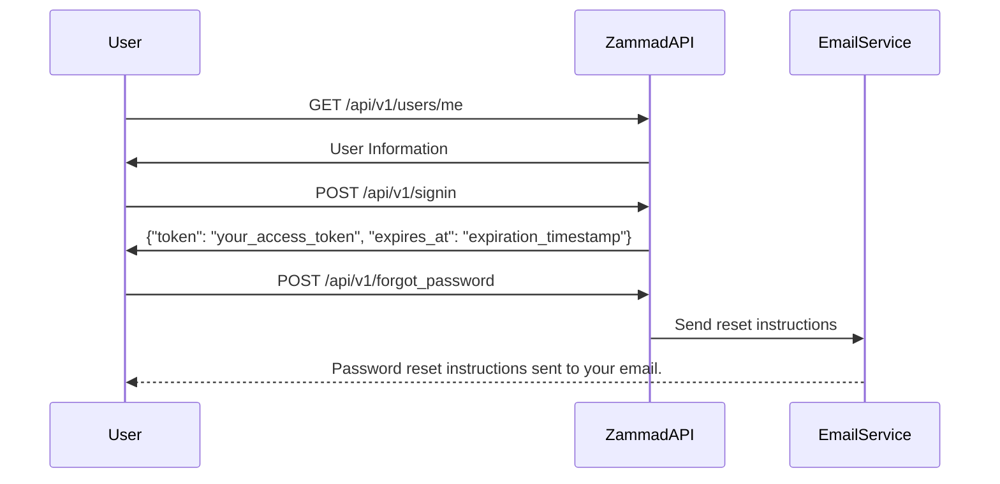
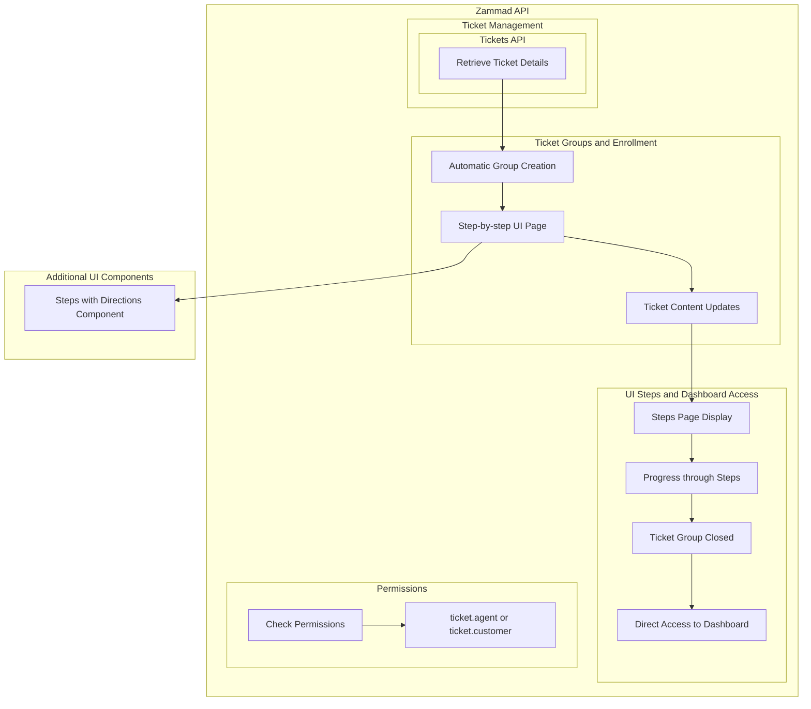

# Zammad API Documentation

## Introduction

This documentation provides details on the Zammad API for user authentication and password recovery. The following endpoints are covered:

* [Login](https://tw-elements.com/docs/react/forms/login-form): CSS for user login.
* [Forgot Password](https://tailwindcomponents.com/component/sb-admin-2-forgot-password-page-1): CSS for initiating a password reset.

For additional information and a comprehensive overview of the Zammad API, please refer to the [official documentation](https://docs.zammad.org/en/latest/api/user.html).

## Authentication

Both the Login and Forgot Password endpoints require authentication. The current user can access their information through a GET request to the `/api/v1/users/me` endpoint.

### GET /api/v1/users/me

#### Request

```bash
curl -X GET https://your-zammad-instance/api/v1/users/me
```

#### Response

```json
HTTP/1.1 200 OK

{
   "id": 3,
   "organization_id": 2,
   "login": "chris@chrispresso.com",
   "firstname": "Christopher",
   "lastname": "Miller",
   "email": "chris@chrispresso.com",
   "image": "7a6a0d1d94ad2037153cf3a6c1b49a53",
   "image_source": null,
   "web": "",
   "phone": "",
   "fax": "",
   "mobile": "",
   "department": null,
   "street": ""
}
```

## User Login

### POST /api/v1/signin

#### Request

```bash
curl -X POST https://your-zammad-instance/api/v1/signin \
  -H "Content-Type: application/json" \
  -d '{
    "login": "chris@chrispresso.com",
    "password": "your_password"
  }'
```

#### Response

```json
HTTP/1.1 200 OK

{
   "token": "your_access_token",
   "expires_at": "expiration_timestamp"
}
```

## Forgot Password

### POST /api/v1/forgot_password

#### Request

```bash
curl -X POST https://your-zammad-instance/api/v1/forgot_password \
  -H "Content-Type: application/json" \
  -d '{
    "login": "chris@chrispresso.com"
  }'
```

#### Response

```json
HTTP/1.1 200 OK

{
   "message": "Password reset instructions sent to your email."
}
```

**Note:** The provided samples were provided with admin and ticket.agent permissions. Some attributes/information may not be available in specific situations. Refer to the [Permission Guide](https://docs.zammad.org/en/latest/api/user.html) for more insights.

* * *



## Ticket Management

Zammad provides a comprehensive API for managing tickets, including details retrieval for an already initiated process. The relevant endpoint is:

* [Tickets API](https://docs.zammad.org/en/latest/api/ticket/index.html?highlight=tickets): Endpoint for interacting with tickets.

For detailed information and additional endpoints, please refer to the [official documentation](https://user-docs.zammad.org/en/latest/basics/what-is-a-ticket.html#).

## Ticket Groups and Enrollment

Zammad automatically creates groups for new users during the enrollment process. The enrollment involves several tracked steps, and the progress is monitored through tickets associated with these groups. The user interface (UI) displays a step-by-step page showcasing ticket content related to each step.

### Retrieve Ticket Details

To obtain information about a specific ticket, the following endpoint can be used:

#### GET /api/v1/tickets/{ticket id}

##### Request

```bash
curl -X GET https://your-zammad-instance/api/v1/tickets/{ticket_id} \
  -H "Authorization: Bearer your_access_token"
```

##### Response

```json
HTTP/1.1 200 OK

{
   "id": 3,
   "group_id": 1,
   "priority_id": 2,
   "state_id": 4,
   "organization_id": 3,
   "number": "22003",
   "title": "Order 787556",
   "owner_id": 3,
   "customer_id": 7,
   "note": null,
   "first_response_at": null,
   "first_response_escalation_at": null,
   "first_response_in_min": null,
   "first_response_diff_in_min": null,
   "close_at": null,
   "close_escalation_at": null,
   "close_in_min": null,
   "close_diff_in_min": null,
   "update_escalation_at": null,
   "update_in_min": null,
   "update_diff_in_min": null,
   "last_contact_at": "2021-06-03T09:57:17.987Z",
   "last_contact_agent_at": "2021-06-03T09:57:17.987Z",
   "last_contact_customer_at": "2021-06-01T11:57:17.935Z",
   "last_owner_update_at": null,
   "create_article_type_id": 1,
   "create_article_sender_id": 2,
   "article_count": 2,
   "escalation_at": null,
   "pending_time": null,
   "type": null,
   "time_unit": null,
   "preferences": {},
   "updated_by_id": 4,
   "created_by_id": 7,
   "created_at": "2021-06-01T11:57:17.935Z",
   "updated_at": "2021-11-03T11:57:17.997Z"
}
```

### UI Steps and Dashboard Access

The UI presents a step-by-step page that guides users through the enrollment process. Each step corresponds to a tracked ticket associated with the created group. The ticket content is dynamically updated as users progress through each step.

**Important:** The steps page remains visible until all required steps are completed. Once the associated ticket group is marked as closed, users gain direct access to the dashboard.

## Permissions

To access ticket details, users need the appropriate permissions:

* `ticket.agent` or `ticket.customer`

Ensure the provided access token has the necessary permissions for the requests. For further insights into permissions, please refer to the [Permission Guide](https://docs.zammad.org/en/latest/api/ticket/index.html?highlight=tickets).

## Additional UI Components

Library used but it has been reworked. [Steps with Directions](https://tailwindcomponents.com/component/steps-with-directions) component visually represent the enrollment process.

* * *


```mermaid
graph TD
  subgraph "Zammad Knowledge Base API"
    A[Retrieve KB Article]
    B[Schema Issue]
    C[Resolution]
    D[Steps to Use]
    A -->|HTTP GET| B
    B -->|Add kb_locale_id attribute| C
    C --> D
  end

  subgraph "ContentLayer Implementation"
    E[Remote Files Source]
    F[Example Implementation]
    G[ContentLayer Documentation]
  end

  subgraph "Implementation Flow"
    H[Zammad Provides KB API]
    I[ContentLayer Loads KB Info]
    J[Users Log In]
    K[ContentLayer Fetches Synced Content]
    L[Changes Occur?]
    M[ContentLayer Updates Content]
    N[No Changes]
  end

  A -->|Error Response| B
  B -->|Add Attribute| C
  C -->|Updated Request| D
  E -->|Syncs Content| F
  F -->|Uses Git Repository| G
  H -->|Retrieves Article Details| I
  I -->|Handles Caching| J
  J -->|Fetches Synced KB Content| K
  K -->|Yes| L
  L -->|Yes| M
  M -->|No| N
  N -->|End| K
```

### Zammad Knowledge Base API

#### Retrieve KB Article

* **Schema Issue:** The provided error indicates a missing attribute in the schema: "Translations kb locale must exist."
* **Resolution:** Add the `kb_locale_id` attribute inside the `translations_attributes`. The specified locale must be created on the server beforehand.

#### Steps to Use:

```bash
curl --location --request POST 'https://your-zammad-instance/api/v1/knowledge_bases/1/answers' \
--header 'Authorization: Token token=_____' \
--header 'Content-Type: application/json' \
--data-raw '{"category_id":"1","translations_attributes":[{"title":"test05 api", "id":"","content_attributes":{"body":"test05 api body"},"kb_locale_id": "your_locale_id"}]}'
```

* Ensure to replace `"your_locale_id"` with the actual locale ID created on the server.

[Zammad Documentation Link](https://community.zammad.org/t/solved-knowledge-base-api-create-article/9127)

### ContentLayer Implementation

#### Remote Files Source

ContentLayer facilitates the synchronization of content files from remote sources. The provided example demonstrates the usage of a remote Git repository.

##### Example Implementation:

```javascript
import { defineDocumentType } from '@contentlayer/source-files'
import { makeSource } from '@contentlayer/source-remote-files'

const Post = defineDocumentType(() => ({
  name: 'Post',
  filePathPattern: `docs/**/*.md`,
  fields: {
    title: { type: 'string', required: false },
    // ... (other fields)
  },
}))

const syncContentFromGit = async (contentDir: string) => {
  const syncRun = async () => {
    const gitUrl = 'https://github.com/vercel/next.js.git'
    // TODO: git pull or git clone (see full example for working code)
  }

  let wasCancelled = false
  let syncInterval

  const syncLoop = async () => {
    await syncRun()

    if (wasCancelled) return

    syncInterval = setTimeout(syncLoop, 1000 * 60)
  }

  // Block until the first sync is done
  await syncLoop()

  return () => {
    wasCancelled = true
    clearTimeout(syncInterval)
  }
}

export default makeSource({
  syncFiles: syncContentFromGit,
  contentDirPath: 'nextjs-repo',
  contentDirInclude: ['docs'],
  documentTypes: [Post],
  disableImportAliasWarning: true,
})
```

#### ContentLayer Documentation

For detailed information on ContentLayer's remote files source, visit the [ContentLayer Remote Files Documentation](https://contentlayer.dev/docs/sources/remote-files-fbb47906).

### Implementation Flow

1. Zammad provides the KB API for retrieving article details.
2. ContentLayer loads information from Zammad's KB, handling caching.
3. Users log in, and ContentLayer fetches information from the synced KB content.
4. If changes occur, ContentLayer updates by dropping and refetching all content.
5. If no changes, nothing is fetched.

This implementation ensures seamless integration between Zammad's KB API and ContentLayer for efficient content retrieval and delivery.

* * *
