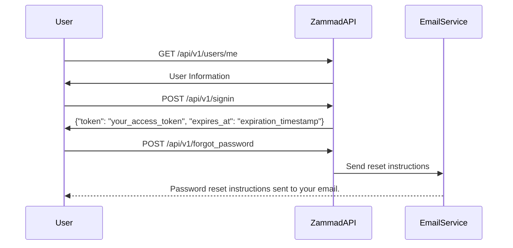

# Zammad API Documentation

## Introduction

This documentation provides details on the Zammad API for user authentication and password recovery. The following endpoints are covered:

* [Login](https://tw-elements.com/docs/react/forms/login-form): CSS for user login.
* [Forgot Password](https://tailwindcomponents.com/component/sb-admin-2-forgot-password-page-1): CSS for initiating a password reset.

For additional information and a comprehensive overview of the Zammad API, please refer to the [official documentation](https://docs.zammad.org/en/latest/api/user.html).

## Authentication

Both the Login and Forgot Password endpoints require authentication. The current user can access their information through a GET request to the `/api/v1/users/me` endpoint.

### GET /api/v1/users/me

#### Request

```bash
curl -X GET https://your-zammad-instance/api/v1/users/me
```

#### Response

```json
HTTP/1.1 200 OK

{
   "id": 3,
   "organization_id": 2,
   "login": "chris@chrispresso.com",
   "firstname": "Christopher",
   "lastname": "Miller",
   "email": "chris@chrispresso.com",
   "image": "7a6a0d1d94ad2037153cf3a6c1b49a53",
   "image_source": null,
   "web": "",
   "phone": "",
   "fax": "",
   "mobile": "",
   "department": null,
   "street": ""
}
```

## User Login

### POST /api/v1/signin

#### Request

```bash
curl -X POST https://your-zammad-instance/api/v1/signin \
  -H "Content-Type: application/json" \
  -d '{
    "login": "chris@chrispresso.com",
    "password": "your_password"
  }'
```

#### Response

```json
HTTP/1.1 200 OK

{
   "token": "your_access_token",
   "expires_at": "expiration_timestamp"
}
```

## Forgot Password

### POST /api/v1/forgot_password

#### Request

```bash
curl -X POST https://your-zammad-instance/api/v1/forgot_password \
  -H "Content-Type: application/json" \
  -d '{
    "login": "chris@chrispresso.com"
  }'
```

#### Response

```json
HTTP/1.1 200 OK

{
   "message": "Password reset instructions sent to your email."
}
```

**Note:** The provided samples were provided with admin and ticket.agent permissions. Some attributes/information may not be available in specific situations. Refer to the [Permission Guide](https://docs.zammad.org/en/latest/api/user.html) for more insights.

* * *
