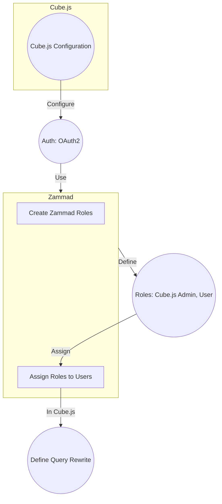

## Zammad Configuration

1. **Establish Zammad Roles:** Define roles within Zammad to align with the desired access levels for Cube.js users. Examples include:
    
    * Cube.js Admin
    * Cube.js User
    
    Ensure each role in Zammad is equipped with the requisite permissions.
    
    ```http
    POST /api/v1/roles
    {
      "name": "Cube.js User",
      "active": true,
      "default_at_signup": false,
      "permission_ids": [
        // Read-only permissions for Cube.js
        57,
        60
      ]
    }
    ```
    
2. **Assign Roles to Users:** Allocate the created roles to Zammad users.
    
    ```http
    PUT /api/v1/users/{user_id}
    {
      "role_ids": [
        // Cube.js User role
        2
      ]
    }
    ```
    

## Cube.js Configuration

1. **Configure Cube.js Authentication:** Update the Cube.js configuration file (`config.development.js` or `config.production.js`) to integrate Zammad for authentication.
    
    ```javascript
    // Cube.js Configuration
    {
      "auth": {
        "type": "oauth2",
        "clientId": "YOUR_CLIENT_ID",
        "clientSecret": "YOUR_CLIENT_SECRET",
        "authorizationUrl": "https://YOUR_ZAMMAD_DOMAIN/oauth/authorize",
        "tokenUrl": "https://YOUR_ZAMMAD_DOMAIN/oauth/token"
      }
    }
    ```
    
    Substituting `YOUR_CLIENT_ID`, `YOUR_CLIENT_SECRET`, and `YOUR_ZAMMAD_DOMAIN` with your Zammad application's credentials.
    
2. **OAuth Configuration in Zammad:**
    
    * Configure the Zammad application with the accurate OAuth settings.
    * In the Zammad admin interface, navigate to application settings and set the Callback URL and Scopes.
3. **Authorize Cube.js:**
    
    * Navigate to the Cube.js web interface.
    * Click the Login button, choosing Zammad as the login provider.
    * Input your Zammad username and password.
    * Complete the authorization process by clicking the Authorize button.

## Access Control in Cube.js

Cube.js will adhere to Zammad roles for user permission determination. Establish access levels in Zammad roles, and Cube.js will enforce these permissions.

```javascript
// Example Cube.js Configuration for Query Rewrite
module.exports = {
  queryRewrite: (query, { securityContext }) => {
    const user = securityContext;
    if (user.id) {
      query.filters.push({
        member: "users.id",
        operator: "equals",
        values: [user.id],
      });
    }
    return query;
  },
};
```

For more details, refer to the [Cube.js Multitenancy Documentation](https://cube.dev/docs/product/configuration/advanced/multitenancy), [Zammad Authentication](https://docs.zammad.org/en/latest/api/user.html), and [Zammad Roles](https://docs.zammad.org/en/latest/api/role.html).
